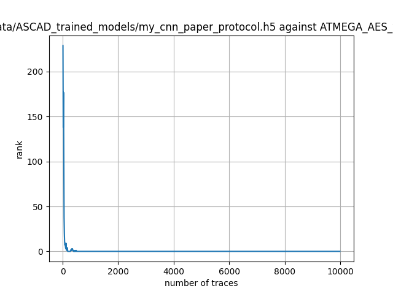

# Week 04 progress report (May 8, 2026)

## Done
1. Inspect the ASCAD dataset and reconfigure the environment on the server. Identify the path confusion in the test scripts that caused the rank graph to fail.

2. Read the entire ASCAD code, including the "generate," "train," and "test" sections. Understand the entire process—how training is performed, how labels are added to the data, multi-label and single-label methods, CNNs and ResNets, etc.

3. Learned how to build models and design processes using TensorFlow.

4. Learned some cryptography, especially GF field multiplication and masking.

5. successfully run ASCAD experiment, output the right rank graph.

## Doing 

## Block and Question

## Next Step
* Get basic knowledge of ResNet
* TS2Vec: look through the paper and try to use the code
* if have time, please go through the tripletPower paper
