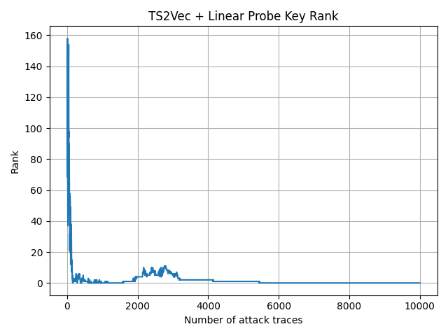

# week05 progress report (May 22, 2026)

## Done
1. successfully run the Ts2Vec algorithem on ASCAD raw dataset, the result is great.

blow is the experiment result:

### TS2Vec Full ASCAD Rank Result

#### Setting

- Dataset: ASCAD.h5
- Profiling traces: 50,000
- Attack traces: 10,000
- TS2Vec epochs: 10
- Representation dimension: 320
- Downstream classifier: Logistic Regression
- Target byte: 2

#### TS2Vec Loss

- Epoch 0: 59.5049
- Epoch 1: 2.5544
- Epoch 2: 1.9165
- Epoch 3: 1.6118
- Epoch 4: 1.3485
- Epoch 5: 1.1018
- Epoch 6: 0.9589
- Epoch 7: 0.8135
- Epoch 8: 0.6686
- Epoch 9: 0.5488

#### Rank Result

- Final rank: 0
- Minimum rank: 0

The correct target key byte was successfully recovered.

The graph is: 

2. have learned basic knowledge of ResNet

## Doing 
1. reading triplet power paper

## Block and Question

## Next Step
