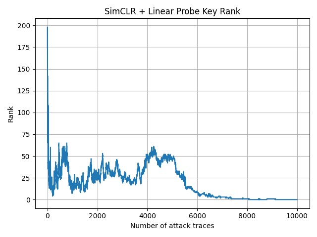
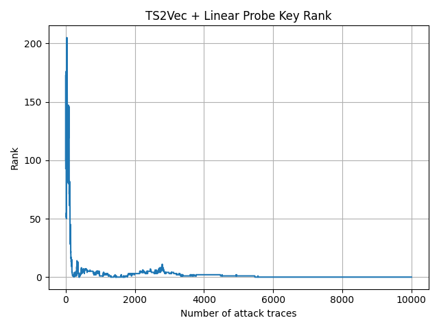
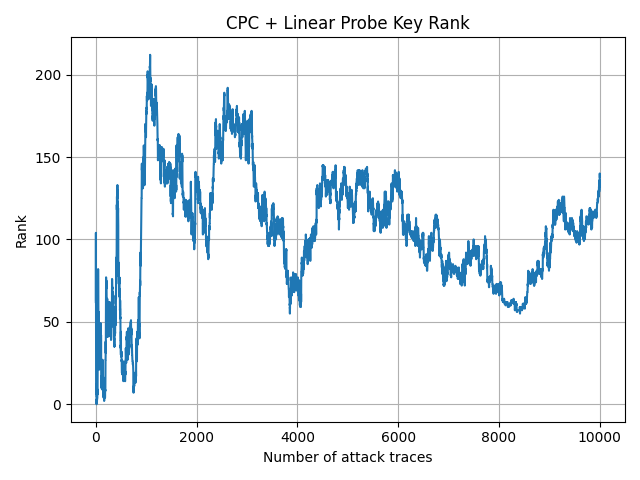

# Week 05 Progress Update(June 5 2026)

## Done
1. read through tripletpower paper, understand the methods, design of experiments, and triplet network.

2. successfully run SimClR and CPC on ASCAD dataset but CPC not perform well(key rank fail to reach 0)

3. note the hyperparameters and network structure in a table

### The following chart shows the graphs for SimClR, TS2vec, and CPC:

- SimClR

- TS2vec

-CPC

### The table blow show the hyperparameters and network structure

| Method | Dataset | N Train | N Attack | Epochs | Batch Size | LR | Repr Dim | Proj Dim | K Steps | T Samples | Classifier | Target Byte | Device | Train Time (s) | Final Rank | Min Rank | Rank-0 Trace |
|---|---|---:|---:|---:|---:|---:|---:|---:|---:|---:|---|---:|---|---:|---:|---:|---:|
| TS2Vec | ASCAD.h5 | 50000 | 10000 | 10 | 64 | 0.001 | 320 | - | - | - | Logistic Regression | 2 | cuda | 326.06 | 0 | 0 | 238 |
| SimCLR | ASCAD.h5 | 50000 | 10000 | 10 | 64 | 0.001 | 320 | 128 | - | - | Logistic Regression | 2 | cuda | 46.20 | 0 | 0 | 8058 |
| CPC | ASCAD.h5 | 50000 | 10000 | 30 | 64 | 0.001 | 320 | - | 3 | 1 | Logistic Regression | 2 | cuda | 104.97 | 138 | 0 | 15 |

## Progress Summary

## Plan for Next Week

## Blockers
