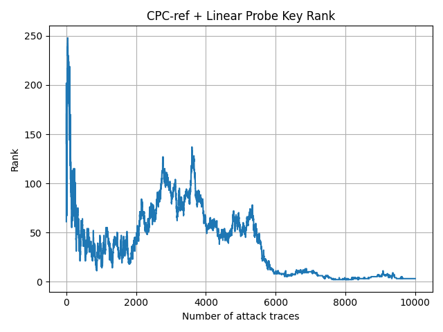
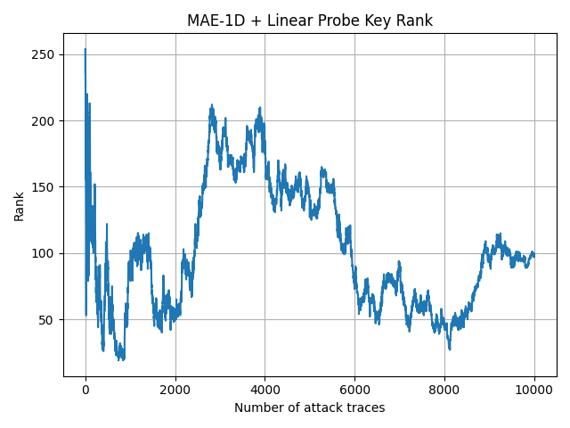
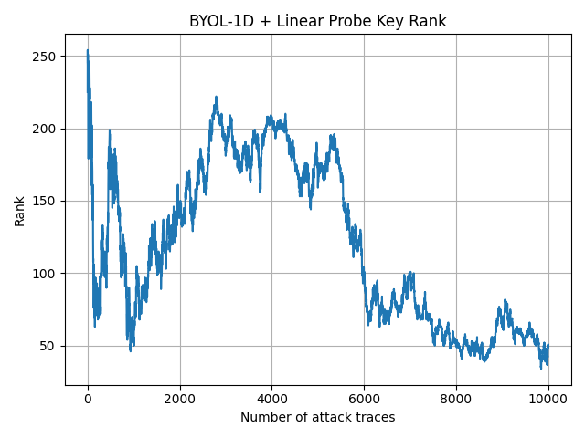

# Week 07 Progress Update(July 3 2026)

## Done
1. The CPC MAE BYOL algorithm ran successfully, but fine-tuning is still needed; the final rank has not yet reached 0.

### The following chart shows the graphs for SimClR, TS2vec, CPC, MAE, BYol:
1. TS2vec 

2. SimClR

3. CPC

4. MAE

5. BYol

### Result Summary

| Method | Variant | Epochs | Batch Size | LR | Final Rank | Min Rank | Rank-0 Trace | Train Time |
|---|---|---:|---:|---:|---:|---:|---:|---:|
| TS2Vec | TS2Vec baseline | 10 | 64 | `1e-3` | **0** | **0** | **238** | 326.06s |
| SimCLR | 1D SimCLR baseline | 10 | 64 | `1e-3` | **0** | **0** | 8058 | 46.20s |
| CPC | CPC-ref pred6 neg10 | 30 | 64 | `2e-4` | 1 | **0** | 379 | 194.34s |
| MAE-1D | 1D masked autoencoder | 30 | 128 | `1e-4` | 98 | 19 | -1 | 228.81s |
| BYOL-1D | 1D BYOL baseline | 30 | 128 | `1e-3` | 49 | 34 | -1 | 176.93s |

### Hyperparameter Details

| Method | Key Hyperparameters |
|---|---|
| TS2Vec | `repr_dim=320`, `encoding_window=full_series`, `target_byte=2`, `classifier=LogisticRegression` |
| SimCLR | `repr_dim=320`, `proj_dim=128`, `augmentation=random_shift(10)+gaussian_noise(0.05)`, `target_byte=2`, `classifier=LogisticRegression` |
| CPC | `repr_dim=320`, `context_dim=320`, `prediction_steps=6`, `negative_samples=10`, `encoder_strides=(2,2,2,2,1)`, `representation=context_mean`, `target_byte=2`, `classifier=LogisticRegression` |
| MAE-1D | `trace_len=700`, `patch_size=10`, `embed_dim=320`, `depth=4`, `num_heads=8`, `mask_ratio=0.50`, `target_byte=2`, `classifier=LogisticRegression` |
| BYOL-1D | `repr_dim=320`, `proj_dim=256`, `hidden_dim=512`, `ema_decay=0.99`, `augmentation=random_shift(10)+gaussian_noise(0.05)+scale_jitter(0.1)+time_mask(0.05)`, `target_byte=2`, `classifier=LogisticRegression` |

## Plan for Next Week

## Blockers
