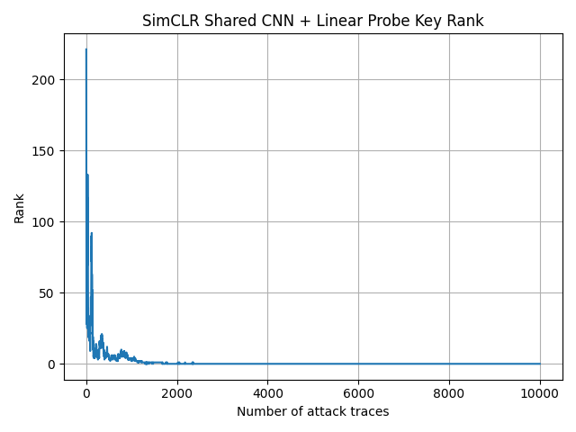

# Week 08 Progress Update(July 24 2026)

## Done
1. Created a unified CNN backbone in `src/models/cnn_zoo.py`. 

2. Replaced the method-specific backbones in all five SSL pipelines with the shared CNN backbone

3. Added a unified trace-window interface to the ASCAD data loader.

4. simclr experiment


## Shared CNN Backbone

All five SSL methods now use the same one-dimensional CNN feature extractor:

```text
Input trace: [B, L, 1]

Conv1D: 1 → 64
BatchNorm1D
ReLU
kernel_size = 11
stride = 2
padding = 5

Conv1D: 64 → 128
BatchNorm1D
ReLU
kernel_size = 11
stride = 2
padding = 5

Conv1D: 128 → 256
BatchNorm1D
ReLU
kernel_size = 11
stride = 2
padding = 5

Conv1D: 256 → 320
BatchNorm1D
ReLU
kernel_size = 11
stride = 2
padding = 5

For an input trace with length 700:

Input shape:                [B, 700, 1]
Temporal feature shape:     [B, 44, 320]
Mean-pooled feature:        [B, 320]
Max-pooled feature:         [B, 320]
Mean+max representation:    [B, 640]

```

## Plan for Next Week


## Blockers
