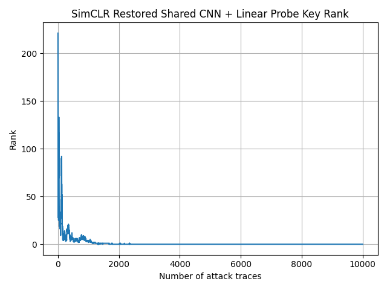
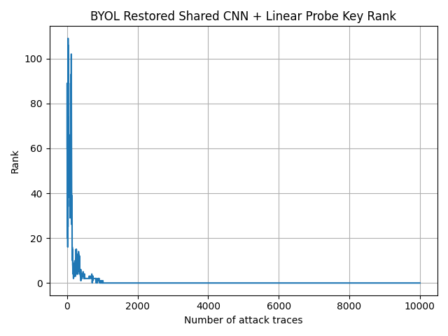
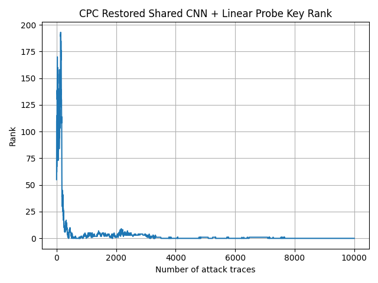
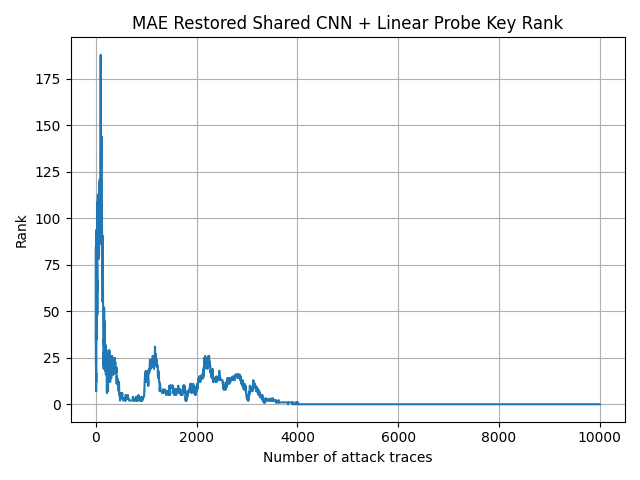
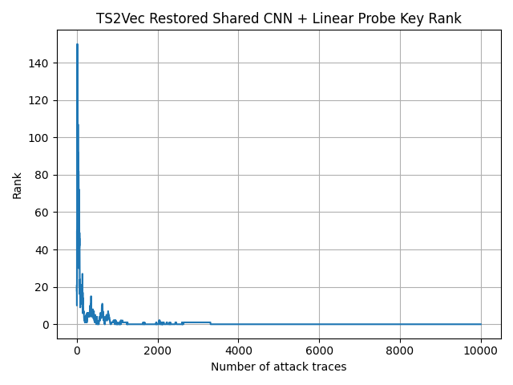

# Weekly Update — Shared Backbone Experiments

## Shared CNN Backbone

All five SSL methods were rerun using the same lightweight 1D CNN backbone.

```text
Input: [B, 700, 1]

Conv1D: 1 → 64
kernel_size = 11
stride = 2
padding = 5
BatchNorm + ReLU

Conv1D: 64 → 128
kernel_size = 11
stride = 2
padding = 5
BatchNorm + ReLU

Conv1D: 128 → 256
kernel_size = 11
stride = 2
padding = 5
BatchNorm + ReLU

Conv1D: 256 → 320
kernel_size = 11
stride = 2
padding = 5
BatchNorm + ReLU

Temporal output:
[B, 44, 320]
```

For downstream evaluation, mean pooling and max pooling are applied over the temporal dimension:

```text
Mean Pool: [B, 44, 320] → [B, 320]
Max Pool:  [B, 44, 320] → [B, 320]

Concatenate → [B, 640]
```

Therefore, all methods are evaluated using the same **640-D representation**, followed by the same Logistic Regression linear probe and AES key-rank evaluation.

Common experimental setup:

- Dataset: ASCAD
- Profiling traces: 50,000
- Attack traces: 10,000
- Trace window: 0–700
- Target byte: 2
- Epochs: 100
- Seed: 42
- Shared backbone: `shared_cnn_v1`
- Downstream representation: 640-D
- Classifier: Logistic Regression

## Experiment Results

| Method | Batch Size | Learning Rate | Final Rank | Min Rank | Rank-0 Trace | Training Time (s) |
|---|---:|---:|---:|---:|---:|---:|
| SimCLR | 64 | 1e-3 | 0 | 0 | 1,295 | 464.61 |
| BYOL | 128 | 3e-4 | 0 | 0 | 712 | 491.23 |
| CPC | 64 | 2e-4 | 0 | 0 | **401** | 532.40 |
| MAE | 128 | 1e-4 | 0 | 0 | 3,810 | 248.88 |
| TS2Vec | 64 | 1e-3 | 0 | 0 | 481 | 611.01 |

All five SSL methods reached **Final Rank 0**.

Based on the first attack trace reaching Rank 0:

```text
CPC     : 401
TS2Vec  : 481
BYOL    : 712
SimCLR  : 1295
MAE     : 3810
```

Under the current shared-backbone setting, CPC achieved the fastest key recovery, followed by TS2Vec and BYOL.

The graphs below are the rank curve of those five algorithm:









