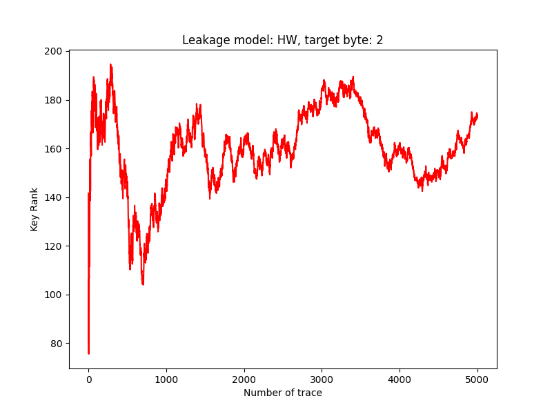
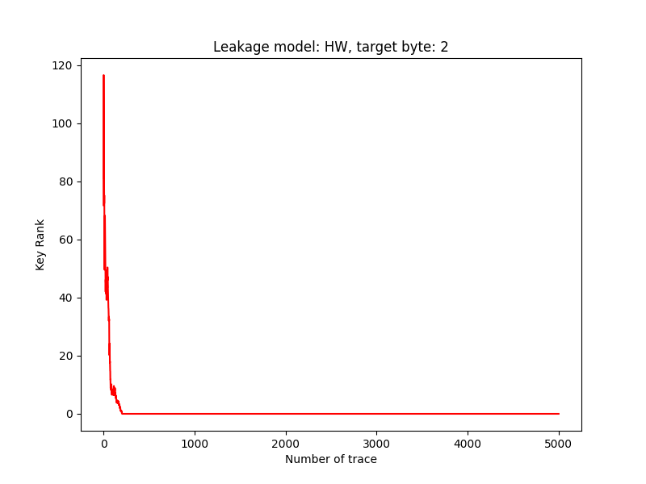

# Weekly Update

## Done

1. Read through and fully understood the original TripletPower code logic.
2. Completed PyTorch implementations for:
   - CNN profiling
   - TripletPower profiling
   - TripletPower on-the-fly / non-profiling pipeline
3. Started profiling experiments on ASCAD.
   - Using the same trace counts as the TripletPower paper, the current ASCAD experiments did not reach key rank 0.
   - Increasing the CNN profiling set to 50,000 traces successfully reached rank 0.
   - TripletPower was then tested with 50,000 profiling traces for 20 epochs, but the key rank still fluctuated and did not show convergence toward rank 0.

## Representative Results

### TripletPower on ASCAD — 50,000 traces, 20 epochs

### TripletPower paper reference

### CNN on ASCAD — 50,000 traces

## Next Steps

Adjust and optimize the TripletPower-on-ASCAD profiling experiment code, with the goal of identifying why the current TripletPower implementation does not reproduce a stable rank-0 trend on ASCAD.