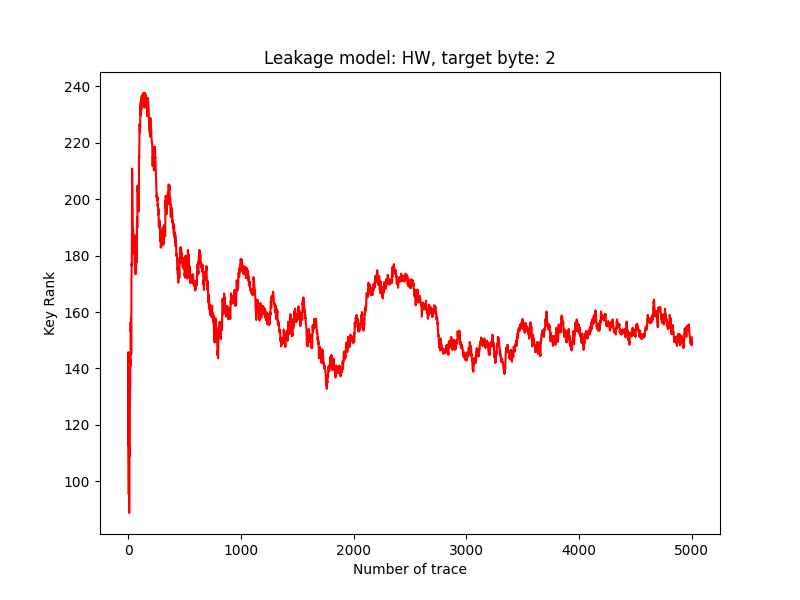
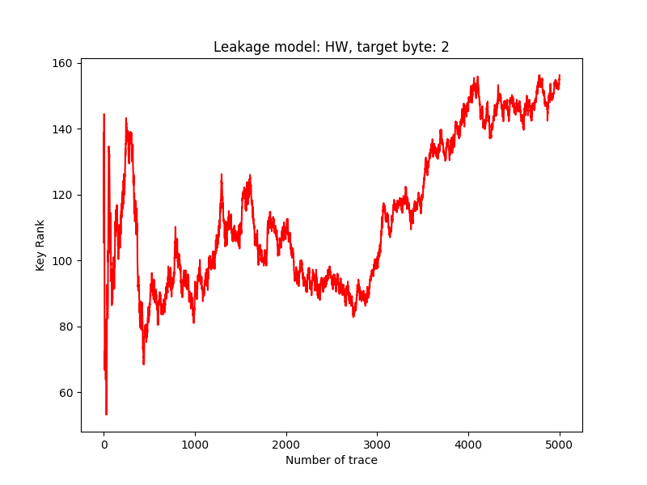

# Weekly Update[cite: 13]

## Done[cite: 13]

1. Comprehensively debugged and validated the PyTorch implementation of the TripletPower pipeline, confirming that the underlying code logic is bug-free.
2. Identified clear overfitting phenomena during the profiling phase and adjusted the training parameters accordingly.
3. Discovered the root cause of the failure on the ASCAD dataset: the data balancing parameter `threshold` (`sample_num_limit`) drastically reduced the actual amount of training data used. The remaining data volume was insufficient to overcome ASCAD's high noise and masking defenses.

## Representative Results[cite: 13]

### TripletPower on ASCAD - Overfitting with low traces

### TripletPower on ASCAD - Adjusting sample_num_limit

## Next Steps[cite: 13]

1. Run the fully validated model on the original datasets used in the TripletPower paper (e.g., XMEGA) to verify if we can successfully reproduce the paper's results.
2. After successful verification on the paper's dataset, pivot back to the ASCAD dataset and attempt to achieve key rank convergence by relaxing the data threshold limits and fine-tuning parameters.